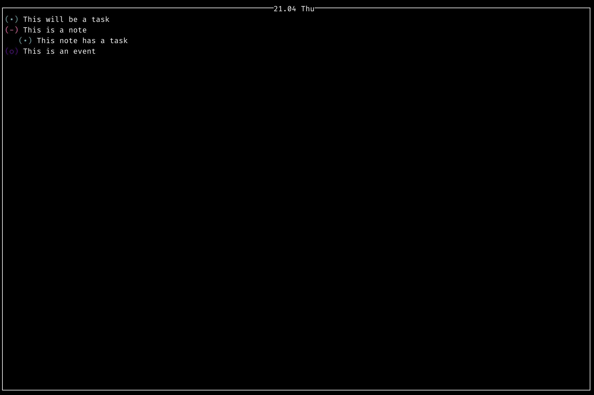
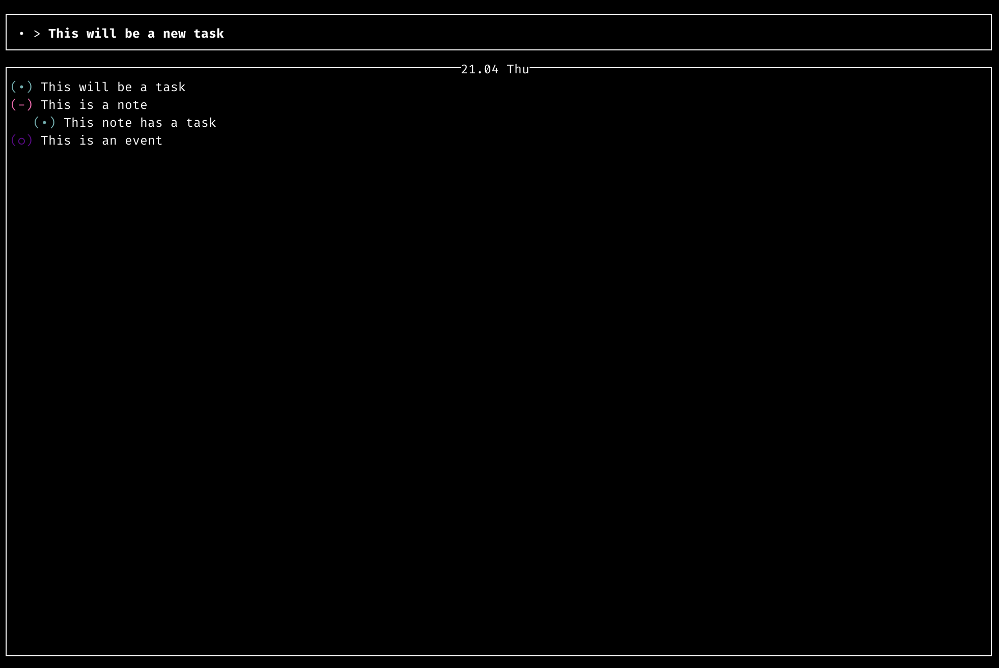

# BJournal

This will be the definitive application to manage bullet journals by a command line. 




## How to run?

The idea is to run the bullet journal application by a simple command in a terminal.
```bash
bj
```

## Why terminal instead of a cool application? 

This terminal application is cross-platforms, and this means that will be used in 
a different architectures and different operative systems. 

The other reason to build this application as a terminal application is the simplicity. This allows to avoid 
distractions and get an approximation to bullet journal culture


